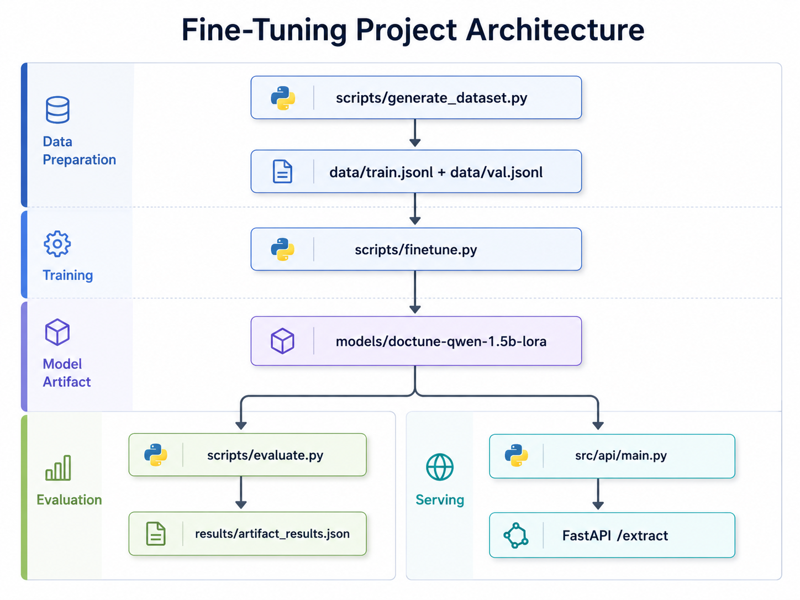

# DocTune — Fine-tuned Document Extractor

[](https://www.python.org/downloads/)
[](LICENSE)
[](https://github.com/huggingface/transformers)
[](https://github.com/huggingface/peft)
[](https://fastapi.tiangolo.com/)
[](https://www.docker.com/)
[](https://huggingface.co/Qwen/Qwen2.5-1.5B-Instruct)

> A compact QLoRA fine-tuning pipeline for structured payroll document extraction. DocTune generates synthetic noisy payslips, fine-tunes Qwen2.5-1.5B-Instruct with LoRA adapters, benchmarks the gain against the base model, and serves the resulting extractor through FastAPI.

## Table of Contents
- [Overview](#overview)
- [Features](#features)
- [Architecture](#architecture)
- [Technology Stack](#technology-stack)
- [Project Structure](#project-structure)
- [Getting Started](#getting-started)
  - [Prerequisites](#prerequisites)
  - [Installation](#installation)
  - [Configuration](#configuration)
  - [Running the Application](#running-the-application)
- [Usage](#usage)
- [Dataset](#dataset)
- [Benchmark](#benchmark)
- [Fine-tuning Details](#fine-tuning-details)
- [Monitoring](#monitoring)
- [Testing](#testing)
- [Model Card](#model-card)
- [License](#license)

## Overview
**DocTune** is a focused document extraction project built to answer one practical question: how much can a small open model improve at structured field extraction after targeted fine-tuning?

The repository covers the full lifecycle:
- synthetic dataset generation for payroll-like documents
- OCR-style noise injection to simulate messy real-world inputs
- QLoRA fine-tuning on a single 8GB GPU
- reproducible evaluation against the base model
- FastAPI inference service with optional constrained JSON generation
- lightweight request logging and drift monitoring

### Key Capabilities
- **Structured JSON extraction**: extracts `employee_name`, `gross_pay`, `tax`, `deductions`, `net_pay`, `pay_period`, and `invoice_number`
- **Noise-aware training**: learns from synthetic documents with broken lines and corrupted characters
- **Low-cost fine-tuning**: uses 4-bit QLoRA to train a 1.5B model on consumer hardware
- **Benchmark-first workflow**: compares base and fine-tuned behavior on held-out data
- **Production-ready serving path**: exposes `/extract`, `/health`, and `/monitoring/drift`

## Features
- **Synthetic data generation**: produces labeled payslip samples with deterministic structure
- **Multi-template coverage**: trains on five layout styles to avoid single-template overfitting
- **OCR noise simulation**: corrupts non-digit characters while preserving label correctness
- **QLoRA fine-tuning**: trains lightweight adapters instead of full model weights
- **4-bit inference**: serves the model with reduced VRAM requirements
- **Optional constrained generation**: can enforce valid JSON output via `lm-format-enforcer`
- **Drift monitoring**: tracks request distribution against training data features

## Architecture


## Technology Stack
| Component | Technology | Purpose |
|-----------|-----------|---------|
| **Base model** | Qwen2.5-1.5B-Instruct | Instruction-tuned foundation model |
| **Fine-tuning** | PEFT LoRA + TRL SFTTrainer | Adapter-based supervised fine-tuning |
| **Quantization** | BitsAndBytes NF4 4-bit | Makes training and inference fit on 8GB VRAM |
| **Framework** | Transformers 4.47.1 | Model loading and generation |
| **API** | FastAPI + Uvicorn | HTTP inference service |
| **Monitoring** | MLflow + Evidently | Training tracking and drift detection |
| **Containerization** | Docker + Docker Compose | GPU-backed serving environment |
| **Data generation** | Faker + Pydantic | Synthetic sample creation and label schema |

## Project Structure
```bash
finetuned-document-extractor/
├── src/
│   ├── api/
│   │   └── main.py                    # FastAPI app and model loading
│   ├── monitoring.py                  # Request logging and drift report
│   └── utils.py                       # JSON extraction helpers
├── scripts/
│   ├── generate_dataset.py            # Synthetic noisy payslip generation
│   ├── finetune.py                    # QLoRA training pipeline
│   ├── evaluate.py                    # Base vs fine-tuned benchmark
│   ├── merge_adapter.py               # Merge LoRA into standalone weights
│   ├── check_data_quality.py          # Dataset quality gate
│   ├── split_data.py                  # Dataset splitting utility
│   ├── test_model_load.py             # Local model loading smoke test
│   └── verify_model_integrity.py      # Model checksum validation
├── data/                              # Train/validation data and request logs
├── models/                            # Base model mount point and LoRA adapter output
├── results/                           # Training and benchmark artifacts
├── tests/                             # API, monitoring, evaluation, and data tests
├── Dockerfile
├── docker-compose.yml
├── MODEL_CARD.md
├── LICENSE
└── README.md
```

## Getting Started
### Prerequisites
- **Python**: 3.11
- **Docker** and **Docker Compose**
- **NVIDIA GPU**: CUDA 12.4-compatible runtime for containerized inference
- **Model files**: local base model directory and LoRA adapter directory under `models/`

### Installation
1. **Clone the repository**
```bash
git clone <repo-url>
cd finetuned-document-extractor
```

2. **Create a virtual environment**
```bash
python -m venv .venv
source .venv/bin/activate
pip install -r requirements.txt
```

3. **Prepare model directories**
```bash
mkdir -p models
```

Place the following assets under `models/`:
- `Qwen2.5-1.5B-Instruct/` for the base model
- `doctune-qwen-1.5b-lora/` for the trained adapter

### Configuration
Create a `.env` file based on `.env.example`:

```env
MODEL_ID=/app/models/Qwen2.5-1.5B-Instruct
ADAPTER_PATH=/app/models/doctune-qwen-1.5b-lora
HF_HOME=/tmp/hf
USE_CONSTRAINED_GENERATION=false
```

### Running the Application
1. **Start the API**
```bash
docker compose up
```

2. **Verify service health**
```bash
curl http://localhost:8000/health
```

3. **Run an extraction request**
```bash
curl -s -X POST http://localhost:8000/extract \
  -H "Content-Type: application/json" \
  -d '{"text":"Employee: Jane Doe\nInvoice #: 84201\nPeriod: March 2025\nGross: $6200.00\nTax Amount: $1240.00\nDeductions: $300.00\nTotal Net: $4660.00"}'
```

## Usage
### Training Workflow
```bash
python scripts/generate_dataset.py
python scripts/check_data_quality.py
python scripts/finetune.py
python scripts/evaluate.py
```

### API Response Shape
```json
{
  "data": {
    "employee_name": "Jane Doe",
    "gross_pay": 6200.0,
    "tax": 1240.0,
    "deductions": 300.0,
    "net_pay": 4660.0,
    "pay_period": "March 2025",
    "invoice_number": "84201"
  },
  "raw_response": "...",
  "constrained": false
}
```

### Merge the Adapter
If you want a standalone model without PEFT loading overhead:

```bash
python scripts/merge_adapter.py \
  --base models/Qwen2.5-1.5B-Instruct \
  --adapter models/doctune-qwen-1.5b-lora \
  --output models/doctune-qwen-1.5b-merged
```

## Dataset
The dataset is fully synthetic and contains no real payroll data.

### Data Design
- **1,000 samples** generated with Faker
- **Split**: 900 train / 100 validation
- **Five document templates**: key-value, abbreviated labels, narrative, table-like, and indented summary
- **Seven output fields**: fixed extraction schema serialized as JSON

### OCR Noise Simulation
The generator applies two forms of noise:
1. **Character corruption**: around 2% of eligible non-digit characters are replaced with symbols
2. **Spurious line breaks**: random line fragmentation is inserted in roughly half of the samples

Digits are intentionally preserved to avoid contaminating numeric labels.

### Target Fields
| Field | Type | Example |
|-------|------|---------|
| `employee_name` | string | `Jane Doe` |
| `gross_pay` | float | `6200.00` |
| `tax` | float | `1240.00` |
| `deductions` | float | `300.00` |
| `net_pay` | float | `4660.00` |
| `pay_period` | string | `March 2025` |
| `invoice_number` | string | `84201` |

## Benchmark
Evaluated on **100 held-out samples** using 4-bit inference for both models.

### Overall
| Metric | Base Model | Fine-tuned (DocTune) | Delta |
|---|---|---|---|
| Valid JSON Rate | 99.0% | **100.0%** | +1.0pp |
| Avg Field Accuracy | 63.86% | **93.71%** | +29.85pp |
| Avg Latency / sample | 3.006s | 3.986s | +32.6% |

### Per-field Accuracy
| Field | Base Model | Fine-tuned | Delta |
|---|---|---|---|
| `employee_name` | 79% | 92% | +13pp |
| `gross_pay` | 56% | 92% | +36pp |
| `tax` | 58% | 94% | +36pp |
| `deductions` | 58% | 91% | +33pp |
| `net_pay` | 60% | **99%** | +39pp |
| `pay_period` | 82% | **99%** | +17pp |
| `invoice_number` | 54% | 89% | +35pp |

The main gain comes from field semantics and numeric extraction accuracy rather than JSON formatting, since the base model already follows the response format well.

## Fine-tuning Details
### Method
DocTune uses **QLoRA** on top of `Qwen/Qwen2.5-1.5B-Instruct`, freezing base weights in 4-bit and training only low-rank adapters.

### Quantization
| Parameter | Value | Purpose |
|---|---|---|
| `load_in_4bit` | `True` | Shrinks VRAM usage |
| `bnb_4bit_quant_type` | `nf4` | Better 4-bit distribution for neural weights |
| `bnb_4bit_compute_dtype` | `float16` | Stable inference compute dtype |
| `bnb_4bit_use_double_quant` | `True` | Extra memory reduction during training |
| `torch_dtype` | `float32` in training | Avoids RTX 2070 mixed-precision instability |

### LoRA Configuration
| Parameter | Value |
|---|---|
| `r` | `16` |
| `lora_alpha` | `32` |
| `lora_dropout` | `0.05` |
| `bias` | `none` |
| `target_modules` | `q_proj`, `k_proj`, `v_proj`, `o_proj`, `gate_proj`, `up_proj`, `down_proj` |

### Training Hyperparameters
| Parameter | Value |
|---|---|
| `per_device_train_batch_size` | `1` |
| `gradient_accumulation_steps` | `8` |
| `learning_rate` | `1e-4` |
| `num_train_epochs` | `3` |
| `warmup_steps` | `10` |
| `optimizer` | `paged_adamw_32bit` |
| `max_length` | `512` |
| `eval_strategy` | `steps` |

### Hardware
Training was designed for a single **NVIDIA RTX 2070 8GB** GPU.

## Monitoring
The API includes lightweight runtime monitoring:
- `log_request()` appends request metadata to `data/request_log.jsonl`
- `/monitoring/drift` compares current request distributions with `data/train.jsonl`
- drift features currently include `text_length` and `field_count`

The drift report requires at least **30 logged requests** before returning a reliable comparison.

## Testing
Run the test suite with:

```bash
pytest
```

The repository includes tests for:
- API behavior
- monitoring utilities
- evaluation helpers
- data quality checks

## Model Card
See [MODEL_CARD.md](MODEL_CARD.md) for intended use, limitations, ethical considerations, and artifact lineage.

## License
This project is licensed under the **MIT License**.

See [LICENSE](LICENSE) for the full text.

Copyright (c) 2026 Maicon Kevyn
